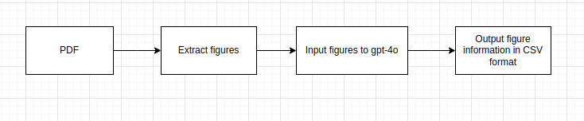

# PDF Image Extraction and Analysis using gpt-4o

This repository contains Python scripts for extracting images from PDF files and analyzing them using the GPT-40 language model. The scripts are designed to facilitate the extraction of graphical information, such as figure plots, from PDF documents, and generate insights or summaries in CSV format.

## image_extraction_pdf.py

This script utilizes the PyMuPDF library to extract figure plots and images from PDF files. It organizes the extracted images into a directory structure based on the input PDF file name. The extracted images can then be used as input for further analysis or processing.

## image_data_extract_llm.py

This script demonstrates how to use the GPT-4o language model (LLM) for analyzing extracted images. It encodes an image file as a base64 string, sends it along with a query to the GPT-4o model, and generates a CSV-formatted response containing details extracted from the image.

